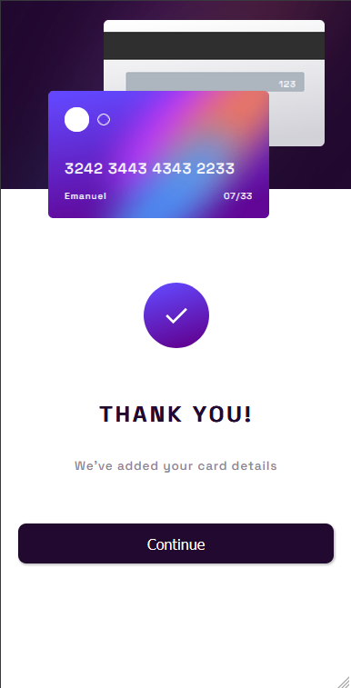

# Frontend Mentor - Interactive card details form solution

This is a solution to the [Interactive card details form challenge on Frontend Mentor](https://www.frontendmentor.io/challenges/interactive-card-details-form-XpS8cKZDWw). Frontend Mentor challenges help you improve your coding skills by building realistic projects.

## Table of contents

- [Overview](#overview)
  - [The challenge](#the-challenge)
  - [Screenshot](#screenshot)
  - [Links](#links)
- [My process](#my-process)
  - [Built with](#built-with)
  - [What I learned](#what-i-learned)
  - [Continued development](#continued-development)

**Note: Delete this note and update the table of contents based on what sections you keep.**

## Overview

### The challenge

Users should be able to:

- Fill in the form and see the card details update in real-time
- Receive error messages when the form is submitted if:
  - Any input field is empty
  - The card number, expiry date, or CVC fields are in the wrong format
- View the optimal layout depending on their device's screen size
- See hover, active, and focus states for interactive elements on the page

### Screenshot

#### Desktop view


Notice different error messages, current state layout and how the content of the card is real-time interactive with the input.


#### Mobile view




### Links

- Solution URL: [Git Hub](https://github.com/naval07/interactive-card-details-form)
- Live Site URL: [Git Hub deployment](https://naval07.github.io/interactive-card-details-form/)

## My process

### Built with

- Semantic HTML5 markup
- CSS custom properties
- Flexbox
- CSS Grid
- Relative and absolute positioning
- Mobile-first workflow
- No extra library or framework

### What I learned

I loved playing with the input fields, creating features like not allowing the user to type numbers in Cardholder name input and helping the user with the card number format, adding a space every 4 digits.

```js
// Function to set letters only on cardholder name input field
cardHolderNameInput.onkeydown = function (event) {
  if (!/^[a-zA-z ]$/.test(event.key) && event.key !== "Backspace") {
    event.preventDefault();
  }
};
```

```js
// Function to set numbers only on card number input field and adding a space every 4 digits
cardNumInput.onkeydown = function (event) {
  if (!/^[0-9]$/.test(event.key) && event.key !== "Backspace") {
    event.preventDefault();
  }

  // Adding a space every 4 digits
  if (cardNumInput.value.match(/[0-9]/g)) {
    // Checking if amount of numbers are mult of 4 and not pressed backspace
    numLength = cardNumInput.value.match(/[0-9]/g).length;
    if (numLength % 4 == 0 && event.key !== "Backspace" && numLength < 16) {
      // Creating list of every 4 digits
      const fourNumberReg = /[0-9]{4}/g;
      try {
        fourNumberList = cardNumInput.value.match(fourNumberReg);
      } catch (e) {
        fourNumberList = [];
      }
      // Adding space if there is no space already as last digit
      if (
        fourNumberList.length >= 1 &&
        cardNumInput.value[cardNumInput.value.length - 1] !== " "
      ) {
        cardNumInput.value += " ";
      }
    }
  }
};
```

### Continued development

I'd like to keep improving on js since I think it's the core of web dev, seeking the development of user interfaces as comfortable as possible, maintaining a fun user experience.

## Thank you for checking this out so far!
